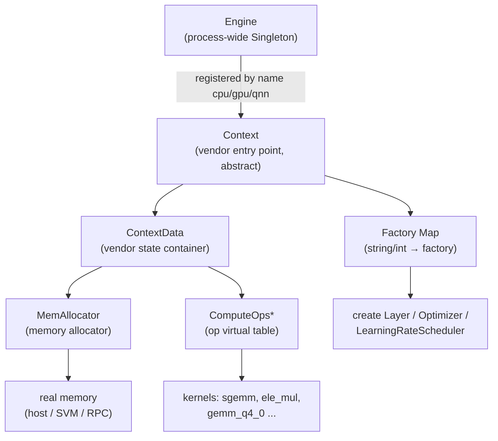
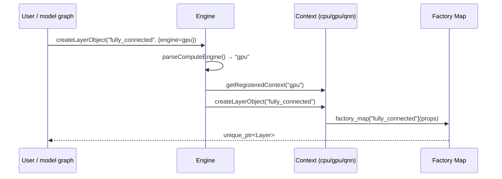
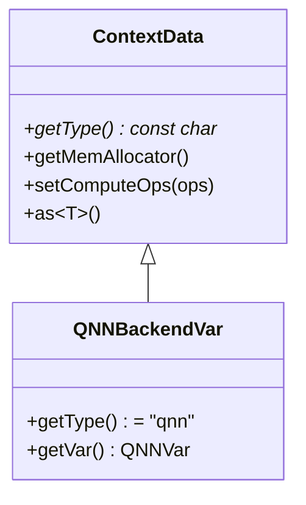
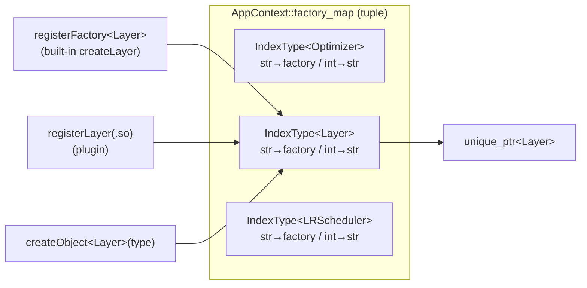
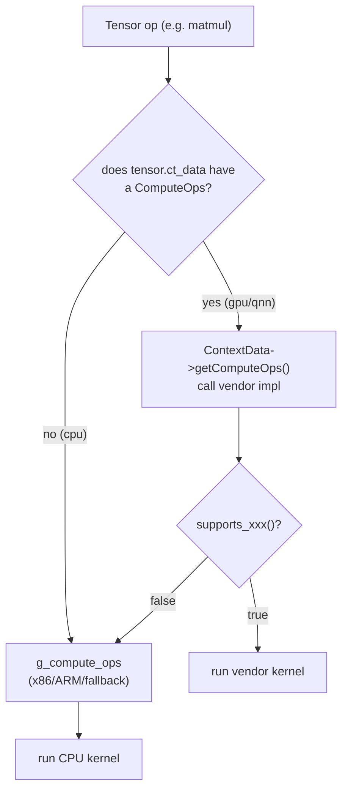
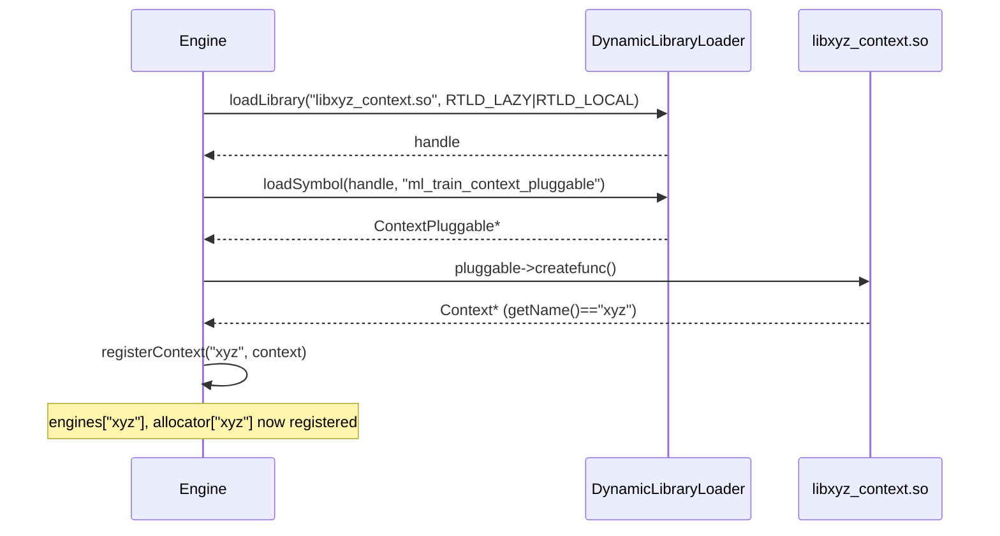

# nntrainer Pluggable Architecture (Walkthrough)

A step-by-step, diagram-driven walkthrough of nntrainer's **pluggable
backend architecture**, written for presentations and onboarding. It
starts at `Engine` and goes down through
`Context → ContextData → Allocator → Layer Factory → Tensor / Op Table`,
then shows **how a new vendor adds a Context**.

> Written from **direct source analysis** (with file:line citations),
> not as a summary of ARCHITECTURE.md. Korean edition:
> [`PLUGGABLE_KO.md`](./PLUGGABLE_KO.md). The design *contract and
> rationale* lives in [`ARCHITECTURE.md`](./ARCHITECTURE.md) — this
> file is the *tutorial*, that one is the *contract*.

---

## 0. The whole thing in one line

The core goal: **dispatch to vendor-specific implementations without
`#ifdef` at the call site.** Every resource hangs off one chain.

```
Engine ─▶ Context ─▶ ContextData ─▶ { MemAllocator, ComputeOps* }
                 └─▶ Factory Map ─▶ Layer / Optimizer / LRScheduler
```



| Layer | Responsibility | Key file |
|---|---|---|
| Engine | Holds & routes vendor `Context`s by name | `nntrainer/engine.h`, `engine.cpp` |
| Context | Vendor entry point: object creation, memory, load | `nntrainer/context.h` |
| ContextData | Per-vendor state (allocator, ops) | `nntrainer/context_data.h` |
| MemAllocator | Per-vendor memory allocation | `nntrainer/mem_allocator.h` |
| Factory Map | type name → create function | `nntrainer/app_context.h` |
| ComputeOps | Op dispatch virtual table | `nntrainer/tensor/cpu_backend/compute_ops.h` |

---

## 1. Engine — the vendor Context registry

`Engine` is a process-wide `Singleton`. It holds up to 16 `Context`s
keyed by **name (`"cpu"`, `"gpu"`, `"qnn"`)** and routes object-creation
requests to the right one.

```cpp
// nntrainer/engine.h
class Engine : public Singleton<Engine> {
  std::unordered_map<std::string, nntrainer::Context *> engines;
  std::unordered_map<std::string,
    std::shared_ptr<nntrainer::MemAllocator>> allocator;

  void registerContext(std::string name, nntrainer::Context *context) {
    engines.insert({name, context});
    allocator.insert({name, context->getMemAllocator()});
  }
public:
  int registerContext(const std::string &library_path,   // load .so plugin
                      const std::string &base_path = "");
  nntrainer::Context *getRegisteredContext(std::string name) const;
};
```

Default Contexts are registered at boot (`engine.cpp:40`):

```cpp
void Engine::add_default_object() {
  auto &app_context = nntrainer::AppContext::Global();
  ensureComputeOps();                       // bind CPU op table once
  registerContext("cpu", &app_context);

#if ENABLE_OPENCL == 1
  registerContext("gpu", &nntrainer::ClContext::Global());
#endif
#if ENABLE_NPU == 1
  registerContext("libqnn_context.so", ""); // QNN loaded as .so plugin
#endif
}
```

> Key point: **CPU/GPU are registered directly (built-in)** while
> **QNN is loaded as a `.so` plugin**. Both built-in and plugin paths
> enter through the same `registerContext` door.

Routing is decided by the `engine=` property keyword (`engine.h`):

```cpp
std::unique_ptr<nntrainer::Layer>
createLayerObject(const std::string &type,
                  const std::vector<std::string> &properties = {}) const {
  auto ct = getRegisteredContext(parseComputeEngine(properties)); // default "cpu"
  return ct->createLayerObject(type);
}
```



---

## 2. Context — the vendor entry point (abstract class)

`Context` (`nntrainer/context.h`) is the user-facing entry point for a
vendor backend. Layer/Optimizer/LRScheduler creation and memory/weight
load all flow through it.

```cpp
class Context {
public:
  Context(std::shared_ptr<ContextData> data_ = nullptr) : data(data_) {}
  virtual ~Context() = default;

  virtual int init() { return 0; }

  virtual PtrType<nntrainer::Layer>
  createLayerObject(const std::string &type, const PropsType & = {}) {...}
  virtual PtrType<nntrainer::Optimizer>
  createOptimizerObject(const std::string &type, const PropsType & = {}) {...}
  virtual PtrType<ml::train::LearningRateScheduler>
  createLearningRateSchedulerObject(const std::string &type, ...) {...}

  virtual std::string getName() = 0;                 // "cpu" / "gpu" / "qnn"
  std::shared_ptr<ContextData> getContextData() { return data; }
  std::shared_ptr<MemAllocator> getMemAllocator() {
    return getContextData()->getMemAllocator();
  }
  virtual int load(const std::string &file_path) { return 0; }
private:
  std::shared_ptr<ContextData> data = nullptr;       // path to vendor state
};
```

Implementations:

```
Context (abstract)
 ├── AppContext   : Context, Singleton<AppContext>   → getName()="cpu"  (built-in)
 ├── ClContext    : Context, Singleton<ClContext>    → getName()="gpu"  (built-in, OpenCL)
 └── QNNContext   : Context, Singleton<QNNContext>   → getName()="qnn"  (.so plugin)
```

Each Context owns its own `factory_map`, so the same type name can
produce different per-vendor implementations.

---

## 3. ContextData — the vendor state container

`ContextData` (`nntrainer/context_data.h`) is a thin polymorphic
container for per-vendor state. By default it holds a **memory
allocator** and an **op-table pointer**; a vendor needing more state
**subclasses** it.

```cpp
class ContextData {
public:
  virtual ~ContextData() = default;
  virtual const char *getType() const { return "cpu"; }   // NOTE: const char*

  template <typename T> T *as() { return dynamic_cast<T *>(this); }

  std::shared_ptr<MemAllocator> getMemAllocator() { return mem_allocator; }
  void setMemAllocator(std::shared_ptr<MemAllocator> m) { mem_allocator = m; }
  ComputeOps *getComputeOps() { return compute_ops; }
  void setComputeOps(ComputeOps *ops) { compute_ops = ops; }
private:
  std::shared_ptr<MemAllocator> mem_allocator = nullptr;
  ComputeOps *compute_ops = nullptr;
};
```

Vendor extension (QNN):

```cpp
// nntrainer/qnn/jni/qnn_context_var.h
class QNNBackendVar : public ContextData {
public:
  const char *getType() const override { return "qnn"; }
  std::shared_ptr<QNNVar> &getVar() { return data; }   // QNN backend handle etc.
private:
  std::shared_ptr<QNNVar> data;
};
```



**A Tensor carries a `shared_ptr<ContextData>`** — so a tensor
remembers which backend it belongs to and reaches the right allocator /
ComputeOps through it.

---

## 4. Context Allocator — per-vendor memory allocator

`MemAllocator` (`nntrainer/mem_allocator.h`) is the allocation
abstraction.

```cpp
class MemAllocator {
public:
  virtual void alloc(void **ptr, size_t size, size_t alignment);
  virtual void free(void *ptr);
  virtual std::string getName() { return "cpu"; }   // default: host malloc
};
```

A per-vendor subclass plugged onto ContextData makes **tensor memory
land automatically in device-visible space.**

| Allocator | File | Behavior |
|---|---|---|
| `MemAllocator` (default) | `mem_allocator.cpp` | host memory |
| `ClSVMAllocator` | `cl_svm_allocator.h` | OpenCL `clSVMAlloc` (device-shared), host fallback |
| `QNNRpcManager` | `qnn/jni/qnn_rpc_manager.h` | libcdsprpc `rpcmem_alloc` (DSP-shared, zero-copy) |

```
Context.getMemAllocator()
   │  (= getContextData()->getMemAllocator())
   ▼
┌───────────────┬───────────────────┬────────────────────┐
│  cpu          │  gpu              │  qnn               │
│ MemAllocator  │ ClSVMAllocator    │ QNNRpcManager      │
│ host malloc   │ clSVMAlloc/Free   │ rpcmem_alloc/Free  │
└───────────────┴───────────────────┴────────────────────┘
```

At registration `Engine` also copies each Context's allocator into its
`allocator` map, so the memory pool uses the right per-vendor allocator.

---

## 5. Layer Factory — create objects by type name

The factory types are defined in `context.h`. The key idea: **per type,
a tuple pairing a string index and an integer index.**

```cpp
template <typename T>
using FactoryType  = std::function<PtrType<T>(const PropsType &)>;
template <typename T>
using StrIndexType = std::unordered_map<std::string, FactoryType<T>>; // name→ctor
using IntIndexType = std::unordered_map<int, std::string>;            // int→name
template <typename T>
using IndexType    = std::tuple<StrIndexType<T>, IntIndexType>;
template <typename... Ts> using FactoryMap = std::tuple<IndexType<Ts>...>;
```

`AppContext` packs three kinds into one tuple (`app_context.h`):

```cpp
FactoryMap<nntrainer::Optimizer, nntrainer::Layer,
           ml::train::LearningRateScheduler> factory_map;
```

Registration (thread-safe, duplicate-key checked):

```cpp
template <typename T>
const int registerFactory(const FactoryType<T> factory,
                          const std::string &key = "",
                          const int int_key = -1);
```

50+ built-in layers are registered at boot (`app_context.cpp`):

```cpp
registerFactory(nntrainer::createLayer<FullyConnectedLayer>,
                FullyConnectedLayer::type, LayerType::LAYER_FC);
// ... ~50+ layers
```



### Plugin layer / optimizer

Just export one `extern "C"` struct.

```cpp
// layer_devel.h
typedef struct {
  CreateLayerFunc  createfunc;   // nntrainer::Layer*(*)()
  DestroyLayerFunc destroyfunc;  // void (*)(nntrainer::Layer*)
} LayerPluggable;
extern "C" LayerPluggable ml_train_layer_pluggable;
```

Example (`Applications/Custom/pow.cpp`):

```cpp
nntrainer::Layer *create_pow_layer()             { return new PowLayer(); }
void destory_pow_layer(nntrainer::Layer *l)      { delete l; }
extern "C" {
nntrainer::LayerPluggable ml_train_layer_pluggable{
  create_pow_layer, destory_pow_layer};
}
```

Loading path (`app_context.cpp`):

```
registerLayer(path)                         registerPluggableFromDirectory(dir)
   │ dlopen(path)                              │ for *.so in dir:
   │ dlsym("ml_train_layer_pluggable")         │   *_layer.so     → registerLayer
   │ new PluggedLayer(pluggable)               │   *_optimizer.so → registerOptimizer
   │ registerFactory<Layer>(f, type)           ▼
   ▼                                         (directory auto-scan)
registered into factory_map
```

`PluggedLayer` (`layers/plugged_layer.h`) wraps the `.so` impl and
delegates to it through the `nntrainer::Layer` interface.

---

## 6. Tensor and the Op Table (ComputeOps)

### 6.1 Tensor — polymorphic by data type

`Tensor` (`tensor/tensor.h`) is a container; the real implementation is
a per-data-type `TensorBase` subclass.

```
Tensor  (container, type/format set via TensorDim)
  └─ TensorBase
       ├─ FloatTensor   (float*)
       ├─ HalfTensor    (_FP16*)
       ├─ CharTensor / UIntTensor / Int4Tensor
       └─ Q4_0Tensor / Q6_KTensor / BCQTensor (quantized)
```

`TensorBase` carries `shared_ptr<ContextData> ct_data_`, so a tensor is
wired to **its backend's allocator / ComputeOps**.

### 6.2 ComputeOps — the op virtual dispatch table

`ComputeOps` (`tensor/cpu_backend/compute_ops.h`) is **not** a
function-pointer table — it's a **virtual interface**. A vendor
overrides only the ops it supports; the rest stay default (throw, or
CPU fallback).

```cpp
class ComputeOps {
public:
  virtual void sgemm_fp32(...);     // BLAS
  virtual void sgemv_fp32(...);
  virtual float sdot_fp32(...);
  // ... 80+ virtual methods (BLAS / element-wise / activation / quantized)

  // accelerator-only availability predicates
  virtual bool supports_gemm_q4_0_batch_fp32() const { return false; }
  virtual void gemm_q4_0_batch_fp32(...) { /* default-throw */ }
};
```

The global CPU table is lazily initialized once (`compute_ops.cpp`):

```cpp
ComputeOps *g_compute_ops = nullptr;
void ensureComputeOps() {
  std::call_once(g_compute_ops_init_flag, []() { init_backend(); });
}
inline ComputeOps *getComputeOps() {
  if (g_compute_ops == nullptr) ensureComputeOps();
  return g_compute_ops;          // one of x86 AVX2 / ARM NEON / fallback
}
```

Dispatch order:



ASCII summary:

```
op call
  │
  ├─ Tensor has vendor ContextData ─▶ ComputeOps* (vendor)
  │        └─ supports_op() == true ─▶ vendor kernel
  │        └─ supports_op() == false ─▶ CPU fallback
  │
  └─ CPU tensor ─▶ g_compute_ops (x86 AVX2 / ARM NEON / scalar fallback)
```

### 6.3 Build-time selection — not just a CPU-arch story (important)

> **Key: which vendors are alive is decided at build time, not by a
> runtime branch.** There is no `#ifdef` at the call site — only the
> *set of Contexts compiled in and registered* differs per build.

**(1) CPU itself splits by arch.** The CPU backend is not one body of
code. Under `nntrainer/tensor/cpu_backend/` there are three sibling
implementations and `cpu_backend/meson.build` picks **exactly one at
build time** via `host_machine.cpu_family()`:

```
cpu_backend/
 ├─ arm/       NEON kernels      ← arm / aarch64 / android
 ├─ x86/       AVX2 + ggml/BLAS  ← x86_64 / x86
 └─ fallback/  scalar            ← otherwise
```

All three bind the same `CpuComputeOps` (`cpu_ops_table.cpp`) at the
end of their `init_backend()` via `g_compute_ops = get_cpu_ops()`. So
at the call site it is still one `g_compute_ops` — what changed is
**which arch's kernels were compiled into it**. Build-time selection,
not a runtime CPUID branch.

**(2) The same principle applies to whole vendor backends.** QNN,
GPU (OpenCL), and future **S.LSI / MediaTek (MT) backends work the
same way** — each vendor is gated behind a meson option, and only a
build with that option enabled registers its Context on `Engine`:

| Target | Gate (meson) | Registration |
|---|---|---|
| CPU arch (NEON/AVX2/scalar) | `host_machine.cpu_family()` | build-time subdir pick |
| GPU (OpenCL) | `enable-opencl` | built-in `registerContext("gpu", …)` |
| QNN (NPU) | `enable-npu` (+ `qnn-sdk-root`) | `.so` plugin load |
| S.LSI / MT, etc. (planned) | `enable-<vendor>` | built-in or `.so` (vendor's choice) |

```
build A (x86 + opencl)        build B (arm + npu)
 Engine.engines = {            Engine.engines = {
   "cpu"  (x86 AVX2),            "cpu"  (ARM NEON),
   "gpu"  (ClContext) }          "qnn"  (libqnn_context.so) }
```

→ In short, the essence of this architecture is **"one dispatch
interface + a vendor set fixed at build time."** The CPU-arch split is
just the smallest instance of that principle; QNN, GPU, S.LSI and MT
all follow the same rule.

---

## 7. How a new vendor adds a Context

Two paths: **built-in integration** (built into the source tree) and
**`.so` plugin** (decouples an SDK dependency). QNN is the canonical
plugin example.

### 7.1 Common checklist

1. **Place kernels/headers**: put the vendor SDK + kernel wrappers
   under `nntrainer/xyz/` or `nntrainer/tensor/xyz_operations/`, and
   gate the meson `subdir()` behind an `enable-xyz` option so default
   builds are unaffected.

2. **ContextData subclass** (only if the backend needs per-context
   state). `getType()` returns `const char *`, not `std::string`:
   ```cpp
   class XyzBackendVar : public ContextData {
   public:
     const char *getType() const override { return "xyz"; }
     XyzSession *session = nullptr;
   };
   ```

3. **MemAllocator subclass** (only if device-visible memory is
   needed):
   ```cpp
   class XyzAllocator : public MemAllocator {
     void alloc(void **p, size_t n, size_t a) override; // device alloc
     void free(void *p) override;
     std::string getName() override { return "xyz"; }
   };
   ```

4. **ComputeOps subclass**: override only the ops you support.
   Accelerator-only batched ops set `supports_*()` to `true`.
   ```cpp
   class XyzComputeOps : public ComputeOps {
     void sgemm_fp32(...) override { /* uses session_ */ }
     bool supports_gemm_q4_0_batch_fp32() const override { return true; }
     void gemm_q4_0_batch_fp32(...) override { /* ... */ }
   };
   ```

5. **Context subclass**: mirror `ClContext` / `QNNContext`. Pass your
   ContextData to the base ctor; in `initialize()`:
   - call `ensureComputeOps()` (CPU fallback for unsupported ops)
   - construct `XyzComputeOps` and `getContextData()->setComputeOps(...)`
   - `getContextData()->setMemAllocator(...)`
   - register vendor-specific Layer factories
   - `getName()` returns `"xyz"` (empty string is rejected)

6. **Engine wiring** — one of:

   **(a) built-in** (`engine.cpp` `add_default_object`):
   ```cpp
   #if ENABLE_XYZ == 1
     registerContext("xyz", &nntrainer::XyzContext::Global());
   #endif
   ```

   **(b) `.so` plugin** — export the `extern "C"` entry point:
   ```cpp
   // xyz_context.cpp  (built as libxyz_context.so)
   #ifdef PLUGGABLE
   nntrainer::Context *create_xyz_context() {
     auto *c = new nntrainer::XyzContext(); c->Global(); return c;
   }
   void destory_xyz_context(nntrainer::Context *c) { delete c; }
   extern "C" {
   nntrainer::ContextPluggable ml_train_context_pluggable{
     create_xyz_context, destory_xyz_context};
   }
   #endif
   ```
   then in `engine.cpp`:
   ```cpp
   registerContext("libxyz_context.so", "");
   ```

7. **Tests**: attach a `MockXyzComputeOps` via ContextData, exercise
   the dispatch path end-to-end, and assert the op was actually called.

### 7.2 What the plugin loader does (`engine.cpp:registerContext`)

```cpp
int Engine::registerContext(const std::string &library_path,
                            const std::string &base_path) {
  void *handle = DynamicLibraryLoader::loadLibrary(
                   full_path.c_str(), RTLD_LAZY | RTLD_LOCAL);     // 1. dlopen
  auto *pluggable = reinterpret_cast<nntrainer::ContextPluggable *>(
    DynamicLibraryLoader::loadSymbol(handle,
      "ml_train_context_pluggable"));                              // 2. dlsym
  auto context = pluggable->createfunc();                          // 3. create
  auto type = context->getName();                                  // 4. name
  registerContext(type, context);                                  // 5. register
  return 0;
}
```



`ContextPluggable` contract (`context.h`):

```cpp
using CreateContextFunc  = nntrainer::Context *(*)();
using DestroyContextFunc = void (*)(nntrainer::Context *);
typedef struct {
  CreateContextFunc  createfunc;
  DestroyContextFunc destroyfunc;
} ContextPluggable;
extern "C" ContextPluggable ml_train_context_pluggable;
```

> For an op-level backend (CPU/OpenCL style) the steps above are all of
> it. For a graph-compile backend (QNN style) most of the work lives in
> custom Layer classes; the ComputeOps subclass can be just the CPU
> fallback.

---

## 8. Three takeaways for a presentation

1. **One door, two paths**: `Engine::registerContext` accepts both
   built-in Contexts and `.so` plugins and keeps them by name.
2. **ContextData is the waist**: the `ContextData` a tensor carries
   wires allocator + ComputeOps together, so there is no `#ifdef` at
   the call site.
3. **A vendor subclasses four things**: ContextData / MemAllocator /
   ComputeOps / Context — plus exporting a single entry point
   (`ml_train_context_pluggable`). Which of them are alive is a
   **build-time** decision (CPU arch, GPU, NPU, future S.LSI/MT).
