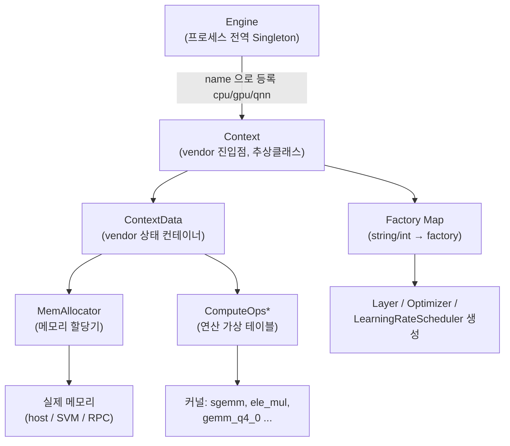
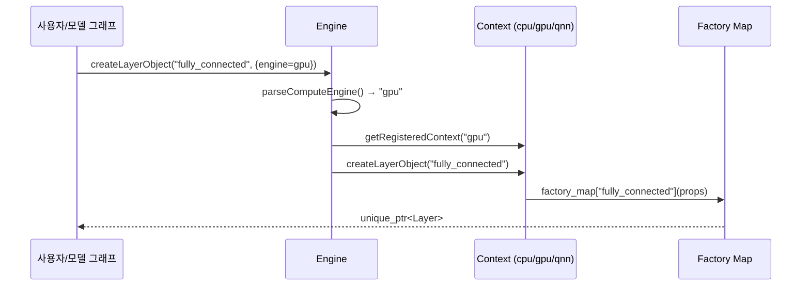
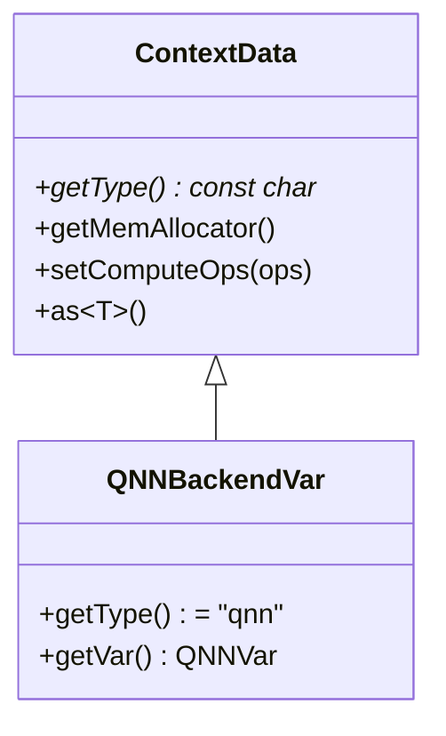
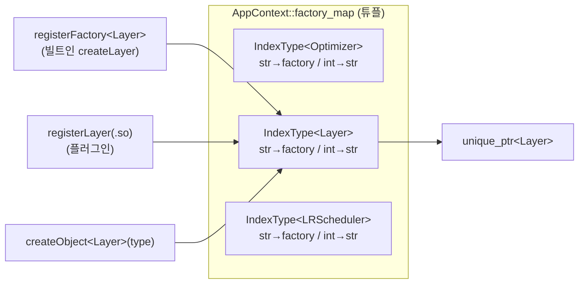
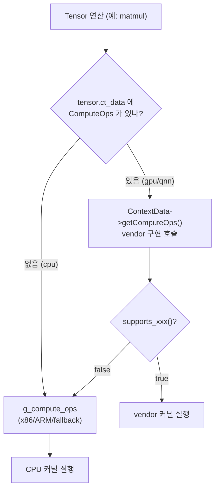
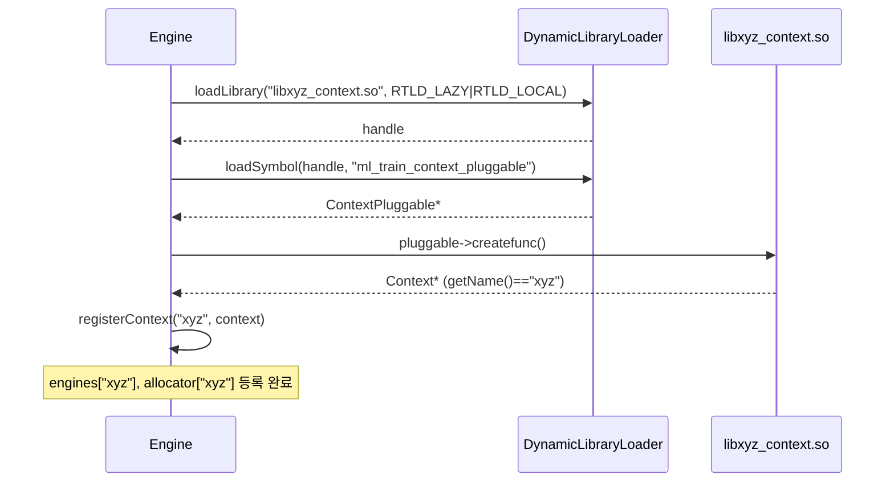

# nntrainer Pluggable 구조 (한글 설명)

이 문서는 nntrainer 의 **pluggable 백엔드 구조**를, 발표·온보딩 용도로
한 단계씩 따라갈 수 있게 정리한 것이다. `Engine` 에서 시작해
`Context → ContextData → Allocator → Layer Factory → Tensor / Op Table`
순서로 내려가고, 마지막에 **다른 vendor 가 새 Context 를 추가하는 방법**을
설명한다.

> 내용은 ARCHITECTURE.md 요약이 아니라 **소스 코드를 직접 분석**해
> 작성했다 (파일:라인 인용 포함). 영문판은
> [`PLUGGABLE_EN.md`](./PLUGGABLE_EN.md), 설계 계약·근거는
> [`ARCHITECTURE.md`](./ARCHITECTURE.md) 를 참고.

---

## 0. 한눈에 보기

핵심은 **"호출 지점에 `#ifdef` 없이 vendor 별 구현으로 분기"** 하는 것이다.
이를 위해 모든 자원이 다음 한 줄로 연결된다.

```
Engine ─▶ Context ─▶ ContextData ─▶ { MemAllocator, ComputeOps* }
                 └─▶ Factory Map ─▶ Layer / Optimizer / LRScheduler
```



| 계층 | 책임 | 대표 파일 |
|---|---|---|
| Engine | vendor `Context` 들을 이름으로 보유·라우팅 | `nntrainer/engine.h`, `engine.cpp` |
| Context | vendor 진입점. 객체 생성·메모리·로드 | `nntrainer/context.h` |
| ContextData | vendor 별 상태 묶음 (allocator, ops) | `nntrainer/context_data.h` |
| MemAllocator | vendor 별 메모리 할당 | `nntrainer/mem_allocator.h` |
| Factory Map | type 이름 → 생성 함수 매핑 | `nntrainer/app_context.h` |
| ComputeOps | 연산 디스패치 가상 테이블 | `nntrainer/tensor/cpu_backend/compute_ops.h` |

---

## 1. Engine — vendor Context 레지스트리

`Engine` 은 프로세스 전역 `Singleton` 이다. 최대 16개의 `Context` 를
**이름(`"cpu"`, `"gpu"`, `"qnn"`)** 으로 들고 있고, 객체 생성 요청을
적절한 Context 로 라우팅한다.

```cpp
// nntrainer/engine.h
class Engine : public Singleton<Engine> {
  std::unordered_map<std::string, nntrainer::Context *> engines;
  std::unordered_map<std::string,
    std::shared_ptr<nntrainer::MemAllocator>> allocator;

  void registerContext(std::string name, nntrainer::Context *context) {
    engines.insert({name, context});
    allocator.insert({name, context->getMemAllocator()});
  }
public:
  int registerContext(const std::string &library_path,   // 플러그인 .so 로드
                      const std::string &base_path = "");
  nntrainer::Context *getRegisteredContext(std::string name) const;
};
```

부팅 시 기본 Context 들이 등록된다 (`engine.cpp:40`):

```cpp
void Engine::add_default_object() {
  auto &app_context = nntrainer::AppContext::Global();
  ensureComputeOps();                       // CPU op table 1회 바인딩
  registerContext("cpu", &app_context);

#if ENABLE_OPENCL == 1
  registerContext("gpu", &nntrainer::ClContext::Global());
#endif
#if ENABLE_NPU == 1
  registerContext("libqnn_context.so", ""); // QNN 은 플러그인 .so 로 로드
#endif
}
```

> 포인트: **CPU/GPU 는 빌트인으로 직접 등록**되지만, **QNN 은 `.so` 플러그인**
> 으로 로드된다. 즉 같은 `registerContext` 라는 입구로 빌트인과 플러그인
> 두 경로가 모두 들어온다.

라우팅은 property 의 `engine=` 키워드로 결정된다 (`engine.h`):

```cpp
std::unique_ptr<nntrainer::Layer>
createLayerObject(const std::string &type,
                  const std::vector<std::string> &properties = {}) const {
  auto ct = getRegisteredContext(parseComputeEngine(properties)); // 기본 "cpu"
  return ct->createLayerObject(type);
}
```



---

## 2. Context — vendor 진입점 (추상 클래스)

`Context` (`nntrainer/context.h`) 는 vendor 백엔드의 사용자 측 진입점이다.
Layer/Optimizer/LRScheduler 생성과 메모리·가중치 로드가 모두 여기를 통한다.

```cpp
class Context {
public:
  Context(std::shared_ptr<ContextData> data_ = nullptr) : data(data_) {}
  virtual ~Context() = default;

  virtual int init() { return 0; }

  virtual PtrType<nntrainer::Layer>
  createLayerObject(const std::string &type, const PropsType & = {}) {...}
  virtual PtrType<nntrainer::Optimizer>
  createOptimizerObject(const std::string &type, const PropsType & = {}) {...}
  virtual PtrType<ml::train::LearningRateScheduler>
  createLearningRateSchedulerObject(const std::string &type, ...) {...}

  virtual std::string getName() = 0;                 // "cpu" / "gpu" / "qnn"
  std::shared_ptr<ContextData> getContextData() { return data; }
  std::shared_ptr<MemAllocator> getMemAllocator() {
    return getContextData()->getMemAllocator();
  }
  virtual int load(const std::string &file_path) { return 0; }
private:
  std::shared_ptr<ContextData> data = nullptr;       // vendor 상태로 가는 통로
};
```

구현체:

```
Context (abstract)
 ├── AppContext   : Context, Singleton<AppContext>   → getName()="cpu"  (빌트인)
 ├── ClContext    : Context, Singleton<ClContext>    → getName()="gpu"  (빌트인, OpenCL)
 └── QNNContext   : Context, Singleton<QNNContext>   → getName()="qnn"  (.so 플러그인)
```

각 Context 는 자신만의 `factory_map` 을 들고 있어, 같은 type 이름이라도
vendor 별로 다른 구현을 생성할 수 있다.

---

## 3. ContextData — vendor 상태 컨테이너

`ContextData` (`nntrainer/context_data.h`) 는 vendor 별 상태를 담는 얇은
다형 컨테이너다. 기본적으로 **메모리 할당기**와 **연산 테이블 포인터**를
들고 있고, vendor 가 추가 상태가 필요하면 **상속**해서 확장한다.

```cpp
class ContextData {
public:
  virtual ~ContextData() = default;
  virtual const char *getType() const { return "cpu"; }

  template <typename T> T *as() { return dynamic_cast<T *>(this); }

  std::shared_ptr<MemAllocator> getMemAllocator() { return mem_allocator; }
  void setMemAllocator(std::shared_ptr<MemAllocator> m) { mem_allocator = m; }
  ComputeOps *getComputeOps() { return compute_ops; }
  void setComputeOps(ComputeOps *ops) { compute_ops = ops; }
private:
  std::shared_ptr<MemAllocator> mem_allocator = nullptr;
  ComputeOps *compute_ops = nullptr;
};
```

vendor 확장 예 (QNN):

```cpp
// nntrainer/qnn/jni/qnn_context_var.h
class QNNBackendVar : public ContextData {
public:
  const char *getType() const override { return "qnn"; }
  std::shared_ptr<QNNVar> &getVar() { return data; }   // QNN 백엔드 핸들 등
private:
  std::shared_ptr<QNNVar> data;
};
```



**Tensor 가 `shared_ptr<ContextData>` 를 들고 다닌다** — 즉 텐서는 자신이
어느 백엔드 소속인지 기억하고, 그 ContextData 를 통해 알맞은 allocator /
ComputeOps 를 찾아간다.

---

## 4. Context Allocator — vendor 별 메모리 할당기

`MemAllocator` (`nntrainer/mem_allocator.h`) 는 메모리 할당의 추상 인터페이스.

```cpp
class MemAllocator {
public:
  virtual void alloc(void **ptr, size_t size, size_t alignment);
  virtual void free(void *ptr);
  virtual std::string getName() { return "cpu"; }   // 기본: host malloc
};
```

vendor 별 구현이 ContextData 에 꽂혀, **텐서 메모리가 자동으로 디바이스가
볼 수 있는 영역에 잡힌다.**

| Allocator | 파일 | 동작 |
|---|---|---|
| `MemAllocator` (기본) | `mem_allocator.cpp` | host 메모리 |
| `ClSVMAllocator` | `cl_svm_allocator.h` | OpenCL `clSVMAlloc` (디바이스 공유), 실패 시 host fallback |
| `QNNRpcManager` | `qnn/jni/qnn_rpc_manager.h` | libcdsprpc `rpcmem_alloc` (DSP 공유, zero-copy) |

```
Context.getMemAllocator()
   │  (= getContextData()->getMemAllocator())
   ▼
┌───────────────┬───────────────────┬────────────────────┐
│  cpu          │  gpu              │  qnn               │
│ MemAllocator  │ ClSVMAllocator    │ QNNRpcManager      │
│ host malloc   │ clSVMAlloc/Free   │ rpcmem_alloc/Free  │
└───────────────┴───────────────────┴────────────────────┘
```

`Engine` 은 등록 시점에 각 Context 의 allocator 를 `allocator` 맵에도
복사해 둬서, 메모리 풀이 vendor 별로 올바른 할당기를 쓰게 한다.

---

## 5. Layer Factory — type 이름으로 객체 생성

Factory 의 타입 정의는 `context.h` 에 있다. 핵심은 **타입별로 (문자열 인덱스,
정수 인덱스) 한 쌍을 묶은 튜플** 이라는 점.

```cpp
template <typename T>
using FactoryType  = std::function<PtrType<T>(const PropsType &)>;
template <typename T>
using StrIndexType = std::unordered_map<std::string, FactoryType<T>>; // 이름→생성자
using IntIndexType = std::unordered_map<int, std::string>;            // 정수키→이름
template <typename T>
using IndexType    = std::tuple<StrIndexType<T>, IntIndexType>;
template <typename... Ts> using FactoryMap = std::tuple<IndexType<Ts>...>;
```

`AppContext` 는 세 종류를 한 튜플에 담는다 (`app_context.h`):

```cpp
FactoryMap<nntrainer::Optimizer, nntrainer::Layer,
           ml::train::LearningRateScheduler> factory_map;
```

등록 함수 (스레드 안전, 중복 키 검사):

```cpp
template <typename T>
const int registerFactory(const FactoryType<T> factory,
                          const std::string &key = "",
                          const int int_key = -1);
```

부팅 시 50개 이상의 빌트인 레이어가 등록된다 (`app_context.cpp`):

```cpp
registerFactory(nntrainer::createLayer<FullyConnectedLayer>,
                FullyConnectedLayer::type, LayerType::LAYER_FC);
// ... 약 50+ 레이어
```



### 플러그인 레이어/옵티마이저

`extern "C"` 구조체 하나만 export 하면 된다.

```cpp
// layer_devel.h
typedef struct {
  CreateLayerFunc  createfunc;   // nntrainer::Layer*(*)()
  DestroyLayerFunc destroyfunc;  // void (*)(nntrainer::Layer*)
} LayerPluggable;
extern "C" LayerPluggable ml_train_layer_pluggable;
```

예제 (`Applications/Custom/pow.cpp`):

```cpp
nntrainer::Layer *create_pow_layer()             { return new PowLayer(); }
void destory_pow_layer(nntrainer::Layer *l)      { delete l; }
extern "C" {
nntrainer::LayerPluggable ml_train_layer_pluggable{
  create_pow_layer, destory_pow_layer};
}
```

로딩 경로 (`app_context.cpp`):

```
registerLayer(path)                         registerPluggableFromDirectory(dir)
   │ dlopen(path)                              │ for *.so in dir:
   │ dlsym("ml_train_layer_pluggable")         │   *_layer.so     → registerLayer
   │ new PluggedLayer(pluggable)               │   *_optimizer.so → registerOptimizer
   │ registerFactory<Layer>(f, type)           ▼
   ▼                                         (디렉터리 자동 스캔)
factory_map 에 등록 완료
```

`PluggedLayer` (`layers/plugged_layer.h`) 가 `.so` 의 구현체를 감싸
`nntrainer::Layer` 인터페이스로 위임한다.

---

## 6. Tensor 와 Op Table (ComputeOps)

### 6.1 Tensor — 데이터 타입별 다형성

`Tensor` (`tensor/tensor.h`) 는 컨테이너이고, 실제 구현은 데이터 타입별
`TensorBase` 서브클래스가 담당한다.

```
Tensor  (container, TensorDim 으로 타입/포맷 지정)
  └─ TensorBase
       ├─ FloatTensor   (float*)
       ├─ HalfTensor    (_FP16*)
       ├─ CharTensor / UIntTensor / Int4Tensor
       └─ Q4_0Tensor / Q6_KTensor / BCQTensor (양자화)
```

`TensorBase` 는 `shared_ptr<ContextData> ct_data_` 를 들고 있어, 텐서가
**자기 백엔드의 allocator / ComputeOps 로 연결**된다.

### 6.2 ComputeOps — 연산 가상 디스패치 테이블

`ComputeOps` (`tensor/cpu_backend/compute_ops.h`) 는 함수 포인터 테이블이
아니라 **가상 함수 인터페이스**다. vendor 가 지원하는 op 만 override 하고,
나머지는 default(throw 또는 CPU fallback)로 둔다.

```cpp
class ComputeOps {
public:
  virtual void sgemm_fp32(...);     // BLAS
  virtual void sgemv_fp32(...);
  virtual float sdot_fp32(...);
  // ... 80+ 가상 메서드 (BLAS / element-wise / activation / quantized)

  // 가속기 전용 op 가용성 술어
  virtual bool supports_gemm_q4_0_batch_fp32() const { return false; }
  virtual void gemm_q4_0_batch_fp32(...) { /* default-throw */ }
};
```

전역 CPU 테이블은 lazy 1회 초기화 (`compute_ops.cpp`):

```cpp
ComputeOps *g_compute_ops = nullptr;
void ensureComputeOps() {
  std::call_once(g_compute_ops_init_flag, []() { init_backend(); });
}
inline ComputeOps *getComputeOps() {
  if (g_compute_ops == nullptr) ensureComputeOps();
  return g_compute_ops;          // x86 AVX2 / ARM NEON / fallback 중 택1
}
```

디스패치 순서:



ASCII 요약:

```
연산 호출
  │
  ├─ Tensor 가 vendor ContextData 보유 ─▶ ComputeOps* (vendor)
  │        └─ supports_op() == true ─▶ vendor 커널
  │        └─ supports_op() == false ─▶ CPU fallback
  │
  └─ CPU 텐서 ─▶ g_compute_ops (x86 AVX2 / ARM NEON / scalar fallback)
```

### 6.3 빌드 타임 선택 — CPU arch 만의 이야기가 아니다 (중요)

> **핵심: 어떤 vendor 가 살아있는지는 런타임 분기가 아니라 빌드 타임에
> 결정된다.** 호출 지점에는 `#ifdef` 가 없고, 단지 그 빌드에 *컴파일되어
> 등록된 Context 집합*만 달라진다.

**(1) CPU 자체가 arch 별로 갈린다.** CPU 백엔드는 한 덩어리 코드가
아니다. `nntrainer/tensor/cpu_backend/` 아래에 형제 구현 3개가 있고,
`cpu_backend/meson.build` 가 `host_machine.cpu_family()` 로 **빌드 시
하나만** 고른다:

```
cpu_backend/
 ├─ arm/       NEON 커널        ← arm / aarch64 / android
 ├─ x86/       AVX2 + ggml/BLAS ← x86_64 / x86
 └─ fallback/  scalar           ← 그 외
```

세 구현 모두 자기 `init_backend()` 끝에서 `g_compute_ops =
get_cpu_ops()` 로 같은 `CpuComputeOps`(`cpu_ops_table.cpp`)를 바인딩한다.
즉 호출 지점에서는 여전히 `g_compute_ops` 하나지만, **그 안에 박힌
커널 본체가 NEON / AVX2 / scalar 로 갈린 것**이다. 런타임 CPUID 분기가
아니라 빌드 타임 선택이다.

**(2) 같은 원리가 vendor 백엔드 전체에 적용된다.** QNN, GPU(OpenCL),
그리고 앞으로 추가될 **S.LSI / MediaTek(MT) 등도 동일한 방식**이다 —
각 vendor 가 meson 옵션 뒤로 게이팅되고, 그 옵션이 켜진 빌드에서만
해당 Context 가 `Engine` 에 등록된다:

| 대상 | 게이트 (meson) | 등록 방식 |
|---|---|---|
| CPU arch (NEON/AVX2/scalar) | `host_machine.cpu_family()` | 빌드 타임 subdir 선택 |
| GPU (OpenCL) | `enable-opencl` | 빌트인 `registerContext("gpu", …)` |
| QNN (NPU) | `enable-npu` (+ `qnn-sdk-root`) | 플러그인 `.so` 로드 |
| S.LSI / MT 등 (예정) | `enable-<vendor>` | 빌트인 또는 `.so` (벤더 선택) |

```
빌드 A (x86 + opencl)        빌드 B (arm + npu)
 Engine.engines = {            Engine.engines = {
   "cpu"  (x86 AVX2),            "cpu"  (ARM NEON),
   "gpu"  (ClContext) }          "qnn"  (libqnn_context.so) }
```

→ 정리하면, **"하나의 디스패치 인터페이스 + 빌드 타임에 고정되는 vendor
집합"** 이 이 구조의 본질이다. CPU arch 분기는 그 원리의 가장 작은 사례일
뿐, QNN·GPU·S.LSI·MT 모두 같은 규칙을 따른다.

---

## 7. 다른 Vendor 가 Context 를 추가하는 방법

두 가지 경로가 있다. **빌트인 통합**(소스 트리에 함께 빌드)과
**플러그인 `.so`**(SDK 의존성 분리). QNN 이 플러그인 방식의 표준 예다.

### 7.1 공통 단계 (체크리스트)

1. **커널/헤더 배치**: vendor SDK·커널 래퍼를 `nntrainer/xyz/` 또는
   `nntrainer/tensor/xyz_operations/` 에 두고, meson `subdir()` 를
   `enable-xyz` 옵션 뒤로 게이팅 → 기본 빌드 영향 없음.

2. **ContextData 서브클래스** (vendor 상태가 필요할 때만):
   ```cpp
   class XyzBackendVar : public ContextData {
   public:
     const char *getType() const override { return "xyz"; }
     XyzSession *session = nullptr;
   };
   ```

3. **MemAllocator 서브클래스** (디바이스 메모리가 필요할 때):
   ```cpp
   class XyzAllocator : public MemAllocator {
     void alloc(void **p, size_t n, size_t a) override { /* device alloc */ }
     void free(void *p) override { /* device free */ }
     std::string getName() override { return "xyz"; }
   };
   ```

4. **ComputeOps 서브클래스**: 지원하는 op 만 override.
   가속기 전용 batched op 는 `supports_*()` 를 `true` 로.
   ```cpp
   class XyzComputeOps : public ComputeOps {
     void sgemm_fp32(...) override { /* session_ 사용 */ }
     bool supports_gemm_q4_0_batch_fp32() const override { return true; }
     void gemm_q4_0_batch_fp32(...) override { /* ... */ }
   };
   ```

5. **Context 서브클래스**: `ClContext`/`QNNContext` 를 미러링.
   생성자에서 자신의 `ContextData` 를 넘기고, `initialize()` 에서:
   - `ensureComputeOps()` 호출 (미지원 op 의 CPU fallback 확보)
   - `XyzComputeOps` 생성 후 `getContextData()->setComputeOps(...)`
   - allocator 를 `getContextData()->setMemAllocator(...)`
   - vendor 전용 Layer factory 등록
   - `getName()` 은 `"xyz"` 반환 (빈 문자열이면 등록 거부됨)

6. **Engine 연결** — 둘 중 하나:

   **(a) 빌트인** (`engine.cpp` `add_default_object`):
   ```cpp
   #if ENABLE_XYZ == 1
     registerContext("xyz", &nntrainer::XyzContext::Global());
   #endif
   ```

   **(b) 플러그인 `.so`** — `extern "C"` 로 진입점 export:
   ```cpp
   // xyz_context.cpp  (libxyz_context.so 로 빌드)
   #ifdef PLUGGABLE
   nntrainer::Context *create_xyz_context() {
     auto *c = new nntrainer::XyzContext();
     c->Global();
     return c;
   }
   void destory_xyz_context(nntrainer::Context *c) { delete c; }
   extern "C" {
   nntrainer::ContextPluggable ml_train_context_pluggable{
     create_xyz_context, destory_xyz_context};
   }
   #endif
   ```
   그리고 `engine.cpp` 에서:
   ```cpp
   registerContext("libxyz_context.so", "");
   ```

7. **테스트**: ContextData 로 주입한 `MockXyzComputeOps` 로 end-to-end
   디스패치 경로를 검증하고, op 가 실제 호출됐는지 확인.

### 7.2 플러그인 로딩 내부 동작 (`engine.cpp:registerContext`)

```cpp
int Engine::registerContext(const std::string &library_path,
                            const std::string &base_path) {
  void *handle = DynamicLibraryLoader::loadLibrary(
                   full_path.c_str(), RTLD_LAZY | RTLD_LOCAL);     // 1. dlopen
  auto *pluggable = reinterpret_cast<nntrainer::ContextPluggable *>(
    DynamicLibraryLoader::loadSymbol(handle,
      "ml_train_context_pluggable"));                              // 2. dlsym
  auto context = pluggable->createfunc();                          // 3. 생성
  auto type = context->getName();                                  // 4. 이름
  registerContext(type, context);                                  // 5. 등록
  return 0;
}
```



`ContextPluggable` 계약 (`context.h`):

```cpp
using CreateContextFunc  = nntrainer::Context *(*)();
using DestroyContextFunc = void (*)(nntrainer::Context *);
typedef struct {
  CreateContextFunc  createfunc;
  DestroyContextFunc destroyfunc;
} ContextPluggable;
extern "C" ContextPluggable ml_train_context_pluggable;
```

> op-level 백엔드(CPU/OpenCL 류)는 위 단계가 전부다. graph-compile
> 백엔드(QNN 류)는 작업 대부분이 custom Layer 클래스에 들어가고,
> ComputeOps 서브클래스는 CPU fallback 만으로 충분할 수 있다.

---

## 8. 발표용 핵심 메시지 3줄

1. **하나의 입구, 두 경로**: `Engine::registerContext` 가 빌트인과 `.so`
   플러그인을 모두 받아 이름으로 보관한다.
2. **ContextData 가 허리**: 텐서가 들고 다니는 `ContextData` 가
   allocator 와 ComputeOps 를 연결해, 호출 지점에 `#ifdef` 가 없다.
3. **vendor 는 4개만 상속**: ContextData / MemAllocator / ComputeOps /
   Context — 그리고 진입점 하나(`ml_train_context_pluggable`)만 export.
